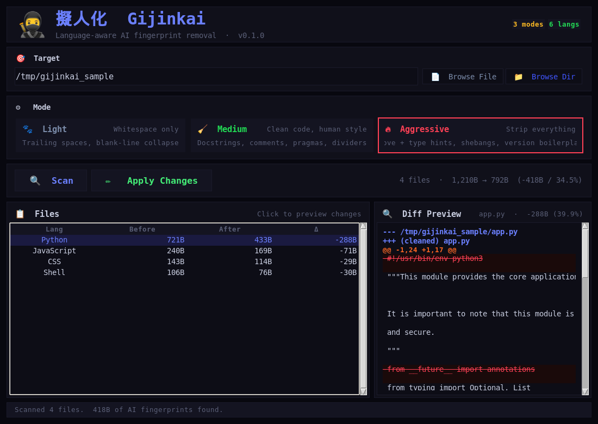

# 🥷 擬人化 Gijinkai

**Language-aware AI fingerprint removal — personify AI-generated code by stripping docstrings, comments, boilerplate, and type hints, per language.**

[](https://python.org)
[](https://github.com/takorunikatora/gijinkai)
[](LICENSE)

## What It Does

Gijinkai scrubs AI fingerprints from source code through **six language-aware rule sets** — no one-size-fits-all regex. A Python docstring gets different treatment than a JSDoc block; a shell comment gets different treatment than a CSS block:

1. **📚 Docstring & Block-Comment Stripping** — Removes AI-style module/class/function docstrings only when they open with formulaic starters (`This module provides…`, `Helper function…`, `@module`, `Section:`). Context-aware: never strips strings used as values or non-docstring triple-quotes.

2. **💬 Obvious-Comment Stripping** — Removes redundant line comments (`# increment the counter`, `// TODO`, `# check if exists`) while preserving any code on the same line.

3. **🚫 Boilerplate & Pragma Removal** — Drops `__all__`, `from __future__ import annotations`, `'use strict'`, `# type: ignore`, `@ts-ignore`, `eslint-disable`, and ASCII divider lines (`# ──────────`).

4. **🧹 Three Intensity Modes** — `light` (whitespace only), `medium` (default: docstrings + comments + pragmas + dividers), and `aggressive` (adds type hints, shebangs, `__version__`/`__author__` boilerplate).

5. **✍️ Prose Rewriting** *(aggressive)* — Rewrites AI tell-tale comment prose in place: filler phrases (`in order to` → `to`), hedging (`it is important to note that` → removed), and rule-of-three marketing triads (`fast, reliable, and secure` → `fast and reliable`).

## Language Coverage

| Language | Extensions | What gets stripped |
|---|---|---|
| **Python** | `.py` `.pyw` | AI docstrings, `__all__`, `from __future__`, `# noqa`, `# type: ignore`, obvious `#` comments, ASCII dividers, type hints (aggressive) |
| **JavaScript** | `.js` `.mjs` `.cjs` | JSDoc blocks, `'use strict'`, `// eslint-disable`, `@ts-ignore`, obvious `//` comments |
| **TypeScript** | `.ts` `.tsx` `.mts` `.cts` | Same as JS + type annotations (aggressive) |
| **HTML** | `.html` `.htm` `.xhtml` | `<!-- Status -->`, `<!-- Setup -->`, AI section comments |
| **CSS** | `.css` `.scss` `.sass` `.less` | `/* Layout - */`, `/* Component: */`, AI section headers |
| **Shell** | `.sh` `.bash` `.zsh` `.ksh` | Over-commented `#` blocks, divider lines |

### Features

- 🖥️ **Desktop GUI** (Tkinter) — neon-dark theme, colour-coded mode cards, clickable results table, side-by-side diff preview
- ⌨️ **CLI** (Typer + Rich) — scriptable, coloured tables, `--dry-run` preview, `--write` apply
- 🌍 **6 languages · 20 extensions** — Python, JavaScript, TypeScript, HTML, CSS, Shell
- 🔍 **Unified diff preview** — red/green highlighting before you commit
- 🧑‍💻 **Dry-run by default** — nothing is modified unless you pass `--write` (CLI) or click Apply (GUI)
- 📦 **Zero-dependency core** — pure-Python regex engine; `typer` + `rich` only for the CLI

## Screenshots

### Desktop GUI

Neon-dark interface with mode selector, results table, and side-by-side diff preview.



## Quick Start

### Linux / macOS

```bash
git clone https://github.com/takorunikatora/gijinkai.git
cd gijinkai
pip install -r requirements.txt

# Launch the desktop GUI
python3 main.py gui

# Preview changes (dry run)
python3 main.py dir /path/to/project --dry-run

# Apply changes in place
python3 main.py dir /path/to/project --write

# Aggressive mode (type hints + shebangs + boilerplate)
python3 main.py dir /path/to/project --aggressive --write
```

### Windows

```bash
python main.py gui

python main.py dir C:\path\to\project --write
```

## Before / After Examples

| Input (AI-generated) | Mode | Output |
|------|------|--------|
| `"""This module provides the core engine…"""` | medium | *(removed)* |
| `# increment the counter` | medium | *(removed, code kept)* |
| `def start(self, config: EngineConfig) -> bool:` | aggressive | `def start(self, config):` |
| `__version__ = "0.1.0"` | aggressive | *(removed)* |
| `# in order to connect` | aggressive | `# to connect` |

## Architecture

```
main.py                 # Entry point (`file`, `dir`, `gui`, `langs`, `version`)
gijinkai/
├── core.py             # Humanization engine — 6 language rule sets, 3 modes
├── cli.py              # Typer CLI (coloured Rich output)
├── gui.py              # Tkinter desktop GUI (neon-dark theme, diff preview)
└── __init__.py         # Version metadata
```

## Requirements

**Zero external dependencies for the core engine.** The CLI needs:

- `typer` — CLI interface
- `rich` — coloured terminal output

`tkinter` (GUI) ships with standard Python — no extra install required.

```bash
pip install -r requirements.txt
```

## Building Standalone Binaries

```bash
# Single-file binary
pyinstaller --onefile --name gijinkai main.py
```

## Security Properties

- ✅ **Static analysis only** — never executes or imports the files it scans
- ✅ **Dry-run by default** — no file is modified unless you explicitly pass `--write` or click Apply
- ✅ **No network access** — runs entirely offline, no telemetry, no outbound calls
- ✅ **Preserves code** — comment stripping keeps the code on the line; only the comment is removed
- ✅ **Language-scoped** — each file is processed only by its own language's rule set

## Project Stats

- **1,525 lines** of Python across 4 modules + entry point
- **6 languages**, **20 file extensions**
- **3 modes** — light, medium, aggressive
- **26 prose-rewrite rules** (blader/humanizer-inspired)
- **2 interfaces** — Tkinter GUI + Typer/Rich CLI

## License

MIT © takorunikatora
